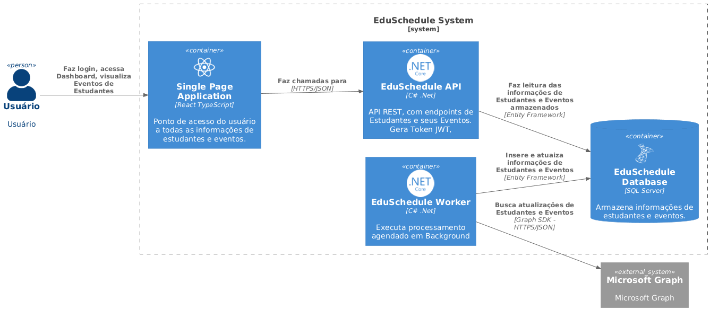
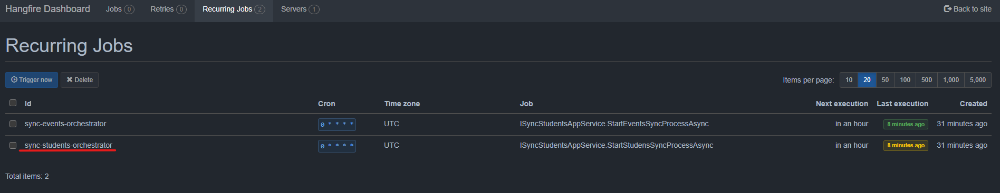
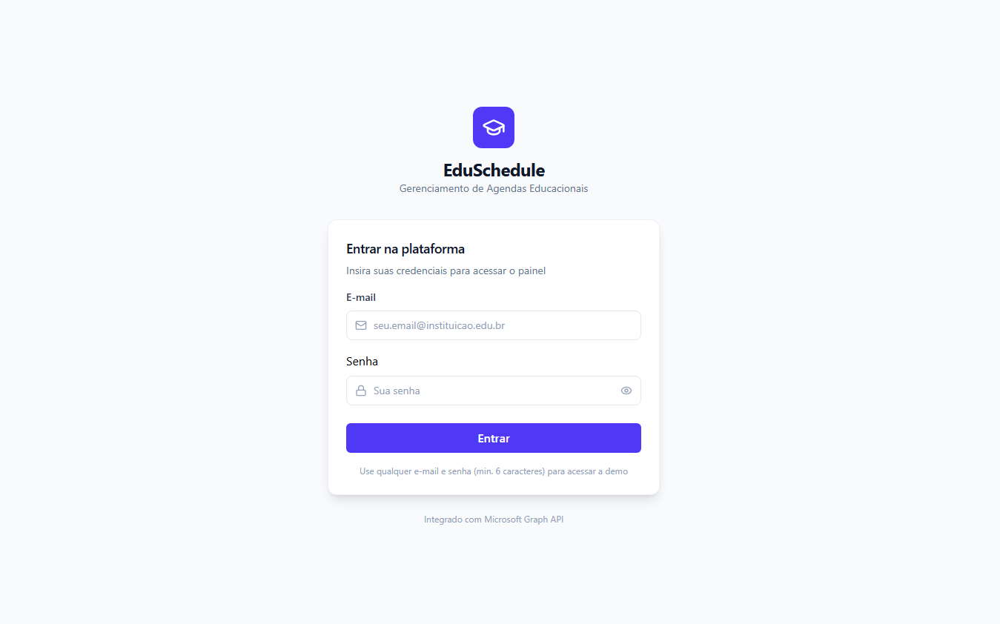
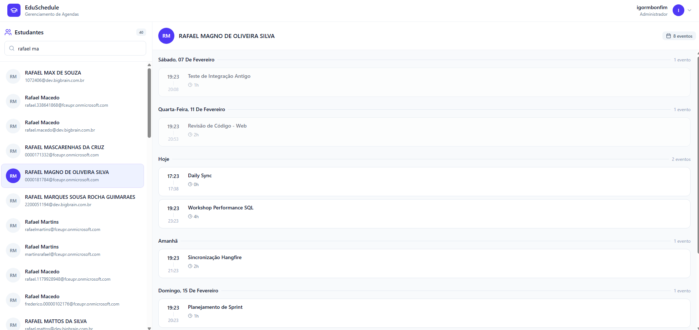
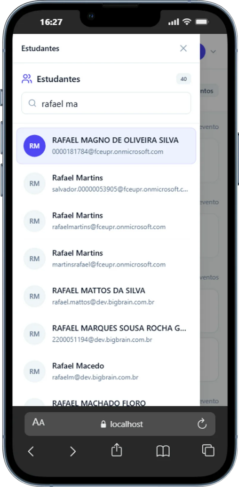
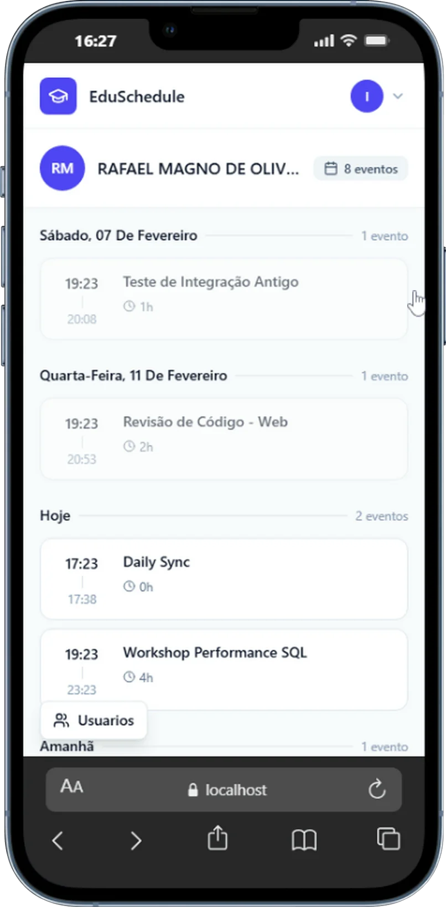

# EduSchedule - Fullstack Challenge

Solução desenvolvida para o desafio técnico de Desenvolvedor Fullstack. O objetivo é uma aplicação que sincroniza e lista estudantes e eventos de uma instituição de ensino integrando com o Microsoft Graph API.

## 📑 Índice

- [Tecnologias Utilizadas](#-tecnologias-utilizadas)
- [Funcionalidades](#-funcionalidades-implementadas)
- [Como Rodar com Docker](#-como-rodar-com-docker-recomendado)
    - [Configuração de Credenciais](#2-configuração-de-credenciais)
    - [Acessando a Aplicação](#4-acessando-a-aplicação)
- [Como Rodar os Testes](#-como-rodar-os-testes-unitários)
- [Atalhos (Makefile)](#-atalhos-opcional---linuxmacwsl)

---

## 🚀 Tecnologias Utilizadas

### **Backend (.NET 8)**
- **Framework:** .NET 8 Web API
- **Arquitetura:** Clean Architecture
- **Banco de Dados:** SQL Server com Entity Framework Core
- **Background Jobs:** Hangfire (para sincronização periódica de grandes volumes de dados)
- **Testes:** xUnit, NSubstitute, FluentAssertions, Bogus
- **Autenticação:** JWT
- **Integração:** Microsoft Graph SDK

### **Frontend (React)**
- **Setup:** Vite + TypeScript
- **Estilização:** Tailwind CSS 
- **Estado/Requisições:** Axios, Context API

### **Infraestrutura**
- **Docker & Docker Compose:** Orquestração completa do ambiente.
- **NGINX:** Utilizado no container Docker para servir a aplicação React.

## 📋 Funcionalidades Implementadas

- [x] **Autenticação:** Proteção de rotas via JWT.
- [x] **Sincronização em Background:** Jobs agendados via Hangfire para buscar/atualizar estudantes e eventos da Microsoft Graph utilizando Delta tokens para reduzir a quantidade de dados processados.
- [x] **Listagem de Estudantes:** Visualização paginada e performática.
- [x] **Detalhes da Agenda:** Visualização dos eventos de um estudante específico.
- [x] **Responsividade:** Interface adaptada para diferentes dispositivos.

## Desenho da arquitetura



## 🐳 Como Rodar com Docker (Recomendado)

O projeto está totalmente conteinerizado, o que elimina a necessidade de instalar .NET ou SQL Server localmente. Sendo necessário apenas o Docker e Docker Compose.

### **1. Clone o repositório**
```bash
git clone https://github.com/IgormBonfim/edu-schedule.git
cd edu-schedule
```

### **2. Configuração de Credenciais**
Antes de subir o ambiente, crie um  arquivo `.env` na raiz do projeto, seguindo o modelo do arquivo `.env.example`

```bash
# Banco de Dados
DB_PASSWORD=
DB_NAME=EduScheduleDb
DB_USER=sa

# Azure / Microsoft Graph
AZURE_TENANT_ID=
AZURE_CLIENT_ID=
AZURE_CLIENT_SECRET=

# Frontend
VITE_API_URL=http://localhost:5077/api

# JWT
SECURITY_KEY=
```

### **3. Executando o Projeto**
Na raiz do projeto (onde está o arquivo `docker-compose.yml`), execute o comando:

```bash
docker-compose up --build
```

Isso irá subir:

API (.NET 8)

Frontend (React)

Banco de Dados (SQL Server)

Worker (Hangfire)

### **4. Acessando a Aplicação**
Após os containers subirem, acesse:

Frontend: http://localhost:5173

Swagger API: http://localhost:5077/swagger

Hangfire Dashboard: http://localhost:5077/hangfire

### **5. Testando**

Acesse o Dashboard do Hangfire e vá até a aba Recurring Jobs. Selecione a Job `sync-students-orchestrator` e execute o `Trigger Now`. O processo de integração de Estudantes irá iniciar em background. O processo dura entre 5 à 0 minutos para processar cerca de 240 mil estudantes.



Acessando o site, você irá se deparar com uma tela de login, a tela é demonstrativa e qualquer e-mail e senha de no minímo 6 caracteres retornará um `Token JWT` válido para a aplicação.



Após realizar o login você será redirecionado para o Dashboard, onde é possivel visualizar todos os estudantes e ver seus eventos.



### Versão Móvel
<p align="center">
  
  
</p>

## 🧪 Como Rodar os Testes Unitários

Para facilitar a avaliação e garantir a consistência do ambiente, os testes unitários foram configurados para rodar dentro de um container Docker isolado. **Não é necessário ter o .NET SDK instalado na sua máquina.**

### Passo Único
Na raiz do projeto (mesmo local do `docker-compose.yml`), execute o comando abaixo:

```bash
docker compose run --rm test
```

## ⚡ Atalhos (Opcional - Linux/Mac/WSL)

Para agilizar o desenvolvimento em ambientes Unix, o projeto inclui um `Makefile`. Se você tiver o `make` instalado, pode utilizar os atalhos abaixo ao invés de digitar os comandos completos do Docker:

| Comando | Equivalente Docker |
| :--- | :--- |
| `make up` | `docker compose up --build -d` |
| `make test` | `docker compose run --rm tests` |
| `make down` | `docker compose down` |
| `make logs` | `docker compose logs -f` |

> **Nota:** Estes comandos são apenas atalhos de conveniência. O projeto roda perfeitamente utilizando apenas os comandos nativos do `docker compose` listados nas seções anteriores.